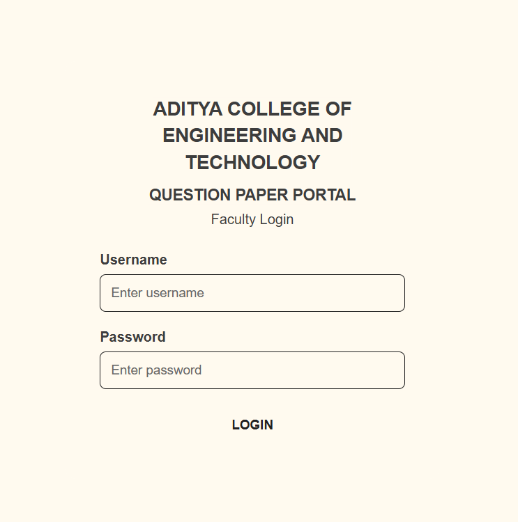
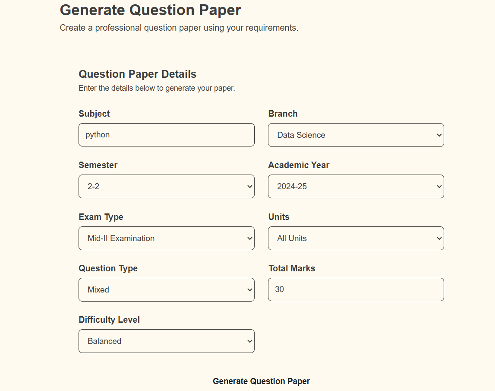
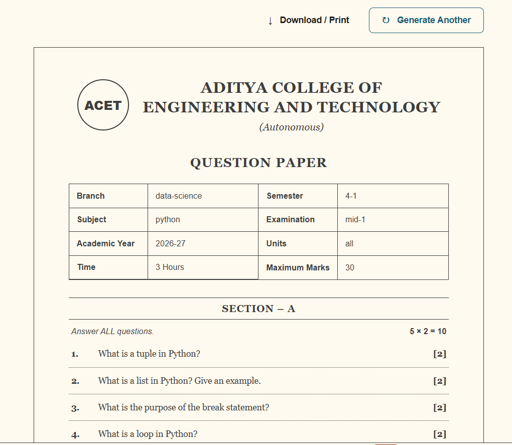

# Question Paper Generator

A professional Django-based web application that generates question papers based on selected academic requirements.

## 🎓 Project Overview

The Question Paper Generator is designed to help faculty create structured and professional question papers quickly.

Users can enter details such as:

- Subject
- Branch
- Semester
- Academic Year
- Examination Type
- Units
- Total Marks
- Difficulty Level
- Question Type

The system then randomly selects suitable questions from a predefined question bank and generates a formatted question paper.

## ✨ Features

- 🔐 Faculty Login
- 📋 Question Paper Generator Dashboard
- 🎯 Unit-based Question Selection
- 📊 Difficulty-based Filtering
- 🔀 Random Question Generation
- 📝 Multiple Question Types
- 💯 Different Total Mark Patterns
- 📄 Professional Question Paper Format
- 🖨️ Print / Download Support
- 🎓 College-branded Question Paper

## 🛠️ Technologies Used

- Python
- Django
- HTML5
- CSS3
- JavaScript

## 📸 Project Preview

### 🔐 Login Page



### 📋 Question Paper Generator Dashboard



### 📄 Generated Question Paper



## 📂 Project Structure

```text
QuestionPaperGenerator/
│
├── config/
├── generator/
│   ├── templates/
│   ├── static/
│   ├── questions.py
│   ├── views.py
│   └── urls.py
│
├── screenshots/
│   ├── login.png
│   ├── dashboard.png
│   └── question-paper.png
│
├── manage.py
├── requirements.txt
├── .gitignore
└── README.md